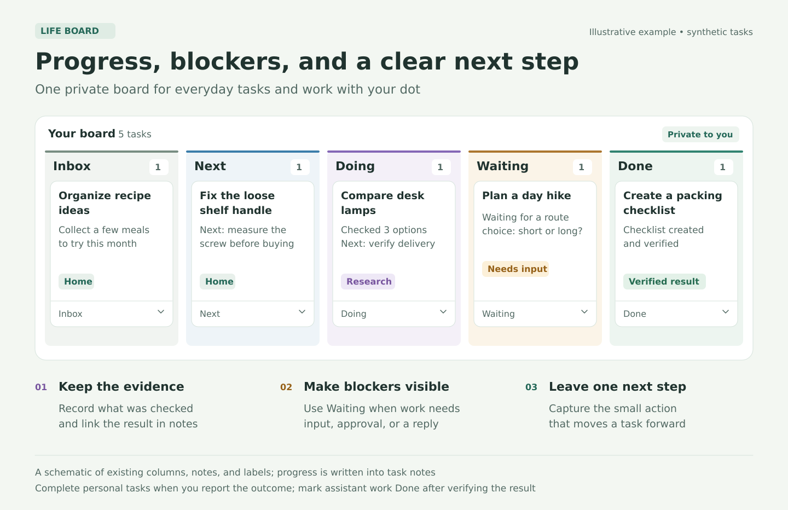
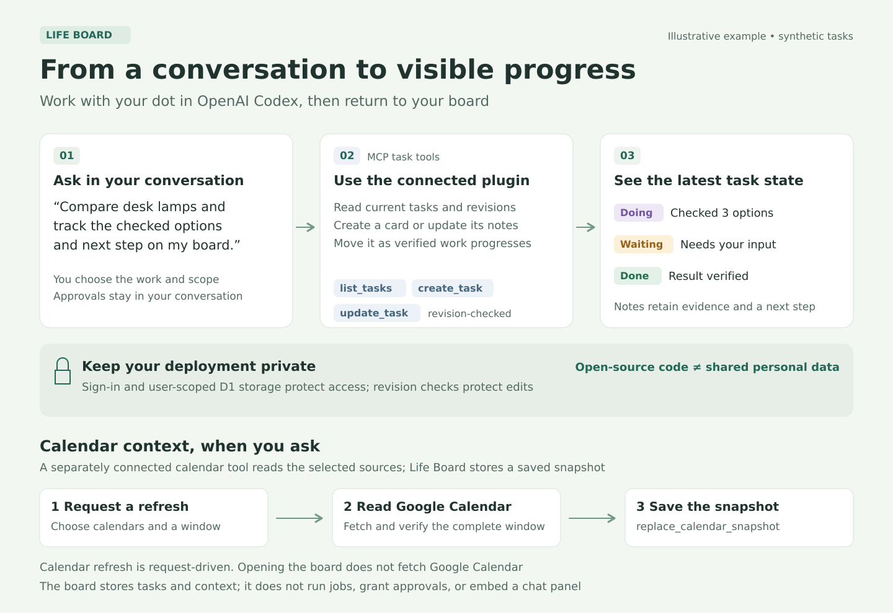

# Life Board

A private place to see what you and your dot are working on, what is moving forward, and what needs your attention.

Life Board brings everyday tasks and assistant work into one Kanban board: **Inbox → Next → Doing → Waiting → Done**. You can use it on desktop or mobile, edit cards yourself, or ask your dot in OpenAI Codex to update your board through a connected plugin.



*An illustrative, synthetic example. Progress and blockers are recorded with the existing notes, labels and columns.*

## A clearer way to work with your dot

Conversations are good at starting work. A board helps you keep track of it afterward.

Put an idea in Inbox, choose a next step, and move it into Doing when work starts. Your dot can record verified progress in the card's notes, keep a useful link to the result, and move a task into Waiting when it needs your input, an approval, or a reply from someone else. When you return, you can see where things stand without searching through every conversation.

These are simple conventions using the existing columns, notes and labels. The board does not start jobs or grant approvals by itself. Tell your dot which work you want it to track and what it is allowed to update.



Once your own Life Board plugin is installed and connected, try:

- “Add ‘Plan a weekend hike’ to Inbox with the label Personal.”
- “Move ‘Compare desk lamps’ into Doing and add what you have checked so far.”
- “Which tasks are waiting for my input? Put the next question in each card's notes.”
- “Track your progress on this task and include the verified result when you finish.”
- “I completed this task. Move it to Done.”
- “Refresh the saved calendar view for my selected Main and Tasks calendars.”
- “Add this task's due date to my Tasks calendar.”

For personal tasks and appointments, completion should come from what you report. Passing a due date or the end of an appointment does not establish that it happened. For assistant work, a finished card should reflect a verified result. Approval still happens in your conversation or the platform's approval flow, rather than by changing a card's label.

## What is included

- One board with the five columns above, card notes, up to eight labels, and date-only due dates
- Drag-and-drop moves plus keyboard/touch-friendly controls
- Recoverable archive and restore
- Durable Cloudflare D1 storage, with user-scoped queries
- Revision checks that reject conflicting edits instead of overwriting newer work; the UI keeps your draft
- Refreshes of stored board data every 30 seconds while the page is visible, plus focus/reconnection refreshes
- A stateless MCP endpoint for conversational task and calendar-context operations
- Browser WebMCP tools when the browser supports them
- A saved calendar view and per-task links to verified Google Calendar entries

There is no embedded ChatGPT conversation panel in this version. Use your Codex/ChatGPT conversation alongside the board. Life Board does not contain an AI model, run autonomous background jobs, or give an assistant new permissions.

## Calendar behavior

The calendar panel is a **request-driven snapshot**. Your assistant reads your selected calendars through a separately connected Google Calendar tool, then saves a complete window into Life Board. Main and Tasks are example calendar roles; choose your own calendars during setup. A snapshot supports one or two calendars, up to 200 event summaries, and at most 14 local calendar days. Source and task-destination IDs stay fixed after the first setup.

Opening the page or its periodic storage refresh does not fetch Google Calendar. There is no automatic calendar synchronization or scheduled refresh. The panel shows when the source was checked; a failed or incomplete refresh should retain the last successful snapshot and mark it stale.

A due date does not create an event. An explicit request for one task can authorize your assistant to create or update a private, non-blocking, all-day entry through Google Calendar, verify the event, and save its link. The app stores supplied event metadata; it never calls Google Calendar itself. Changing a card's title or due date marks a linked entry as needing an update. Completing or archiving a card does not delete the event.

The authenticated `/calendar/maintenance` form offers the same snapshot and link storage operations if a connected plugin has an older tool catalog. Catalog availability can differ by account, connection and publication; the code exposes seven tools, but you should verify what your own connected plugin actually offers. An older connection showing only the three task tools is a setup-specific limitation, not a universal product limit.

## Set up your own board

This repository contains application source and fictional examples. It does not include a running hosted instance, anyone's tasks, calendar data, credentials, or the original private deployment's history.

### Local development

Requires **Node.js ≥22.13.0**, npm, and access to the package registry. The project uses React, Vinext/Vite, Cloudflare Workers/D1 and Drizzle. Vinext is currently pinned to a beta release in the lockfile.

```sh
npm ci
npm run build
# Apply the two checked-in SQL migrations to your local DB; see docs/development.md.
npm run dev
```

Open the loopback address reported by the dev server, normally `http://localhost:5173`. Visit `/signin-with-chatgpt?return_to=/` there to use the fictional local development identity. This simulator works only on loopback and is not a production login system. No OpenAI API key is required by this application. `.env.example` contains optional non-secret development settings.

```sh
npm run typecheck
npm test
npm run lint
npm run build
```

See [development and deployment](docs/development.md) for exact local migration commands and hosting prerequisites.

The release passed type checking, 10 model tests, a production build and 17 local API smoke checks. Five inherited React-hook lint errors remain, along with twelve low/moderate development-tool advisory entries; the recorded production-dependency audit has no known findings. See the [dated validation report](docs/release-validation.md) for scope, dependency patches and limitations.

### Hosted use with Codex

The implemented production path depends on **ChatGPT Sites** for sign-in, private access, trusted identity headers, D1 provisioning and the Site-associated MCP plugin. You need an account/workspace where the relevant Sites and plugin features are available and permitted. Ask Codex to deploy **your own copy** as a new private Site, provision its `DB` binding, apply the existing migrations, and enable its MCP capability. The checked-in hosting manifest is deployment-neutral; registration must add your own project identity.

After publication, install and connect the plugin created for your Site, then verify a read and a sample task update against your board. For a plugin you created, the current supported directory path is Plugins → Personal → Created by you. Installation, Site access and your account's connection are separate steps. The current platform instructions are in [OpenAI's Site-hosted plugin guide](https://help.openai.com/en/articles/20001547-hosting-a-plugin-with-chatgpt-sites).

To use calendar snapshots, connect Google Calendar separately and explicitly select the source calendars and task destination. Keep calendar IDs and imported data in your private datastore, never in source examples or Git.

For hosting outside Sites, you must supply an equivalent authenticated, user-isolated boundary, D1-compatible bindings/migrations, access controls and an MCP authentication/deployment flow. The current server trusts the host's identity headers. Simply exposing its Worker on the public internet is unsafe. An alternative-host production authentication adapter is not included.

## Privacy and safe updates

Open-source availability and access to a personal board are independent. Keep your deployed board private. D1 is authoritative; browser storage is not used for task persistence. Data endpoints require the authenticated Site-scoped user, scope SQL to that identity, and return private/no-store responses. UI writes require same-origin requests. Revision checks protect task, snapshot and link updates; task creation uses a caller-generated UUID for duplicate-safe retries.

The supported view limit is 5,000 tasks or task-event links. Task title, notes and label limits are validated. This is a personal board, not an approval ledger or a shared-team authorization system. Read [security guidance](SECURITY.md) before deploying or changing authentication.

## Contributing and license

Focused improvements, clearer documentation and reproducible bug reports are welcome. See [CONTRIBUTING.md](CONTRIBUTING.md). Use fictional examples and do not put private board data into issues or pull requests.

Life Board's authored application code is available under the [MIT license](LICENSE). Included third-party code and installed dependencies keep their own licenses, including MIT, Apache, MPL and LGPL components. Their licenses are not replaced by this project's MIT license. See [third-party notices and the locked dependency inventory](THIRD_PARTY_NOTICES.md).

Life Board is an independent project. It is not an official OpenAI product or an endorsement by OpenAI.
